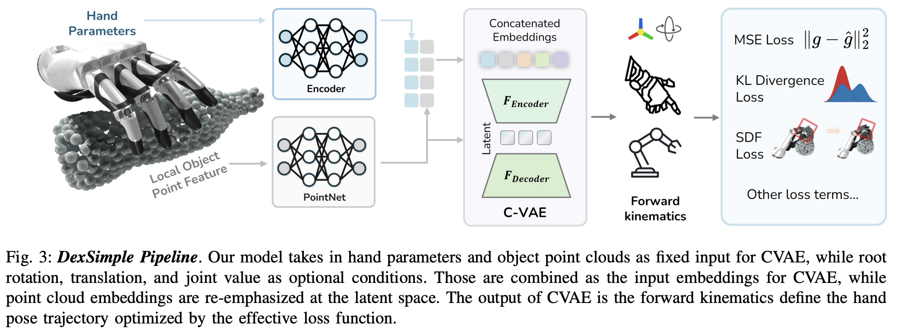

</img>

## Dex1B (wip)

## Citations

```bibtex
@inproceedings{ye2025dex1b,
    title   = {Dex1B: Learning with 1B Demonstrations for Dexterous Manipulation},
    author  = {Ye, Jianglong and Wang, Keyi and Yuan, Chengjing and Yang, Ruihan and Li, Yiquan and Zhu, Jiyue and Qin, Yuzhe and Zou, Xueyan and Wang, Xiaolong},
    booktitle = {Robotics: Science and Systems (RSS)},
    year    = {2025}
}
```
