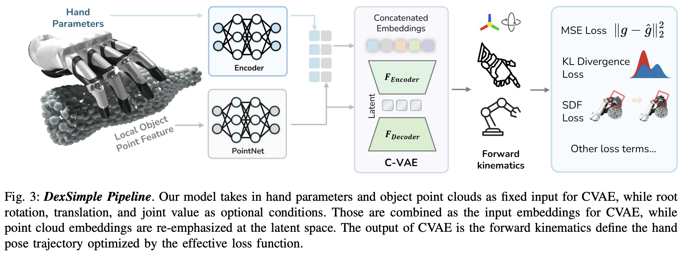

</img>

## Dex1B (wip)

Implementation of **DexSimple**, the generative model and data generation pipeline from [Dex1B: Learning with 1B Demonstrations for Dexterous Manipulation](https://arxiv.org/abs/2506.17198)

## Install

```bash
pip install Dex1B
```

## Usage

```python
import torch
from Dex1B import DexSimple

model = DexSimple(
    dim_pose = 25,
    num_frames = 1,
    condition_on_local_point_feature = False
)

hand_pose = torch.randn(2, 1, 25)
points = torch.randn(2, 1024, 3)

# forward loss

loss = model(hand_pose, points)
loss.backward()

# sample hand poses

sampled_pose = model.sample(points) # (2, 1, 25)
```

Condition on associated local object point feature for debiased data generation:

```python
import torch
from Dex1B import DexSimple, associate_pose_with_object_point, debias_sample

model = DexSimple(
    dim_pose = 25,
    condition_on_local_point_feature = True
)

points = torch.randn(2, 1024, 3)
hand_pose = torch.randn(2, 1, 25)

# associate hand pose with object point along heading direction

assoc_point_indices = associate_pose_with_object_point(
    palm_center = torch.randn(2, 3),
    thumb_tip = torch.randn(2, 3),
    middle_finger_tip = torch.randn(2, 3),
    points = points
)

loss = model(hand_pose, points, assoc_point_indices = assoc_point_indices)
loss.backward()

# debiased sampling - sample associated points inversely proportional to frequency counts

counts = torch.randint(0, 50, (1024,)) # action count per point
sampled_point_indices = debias_sample(counts, num_samples = 32)
```

Gradient post-optimization on sampled poses:

```python
import torch
from Dex1B import post_optimize, HandGeometry

# differentiable forward kinematics module returning hand geometry spheres

class HandFK(torch.nn.Module):
    def __init__(self, dim_pose = 25):
        super().__init__()
        self.fc = torch.nn.Linear(dim_pose, 16 * 3)

    def forward(self, pose):
        centers = self.fc(pose).reshape(pose.shape[0], 16, 3)
        radii = torch.full((16,), 0.02, device = pose.device)
        return HandGeometry(centers, radii)

hand_pose = torch.randn(2, 25)
surface_points = torch.randn(2, 1024, 3)

refined_pose = post_optimize(
    hand_pose,
    hand_fk = HandFK(dim_pose = 25),
    surface_points = surface_points,
    steps = 100
)
```

## Citations

```bibtex
@inproceedings{ye2025dex1b,
    title   = {Dex1B: Learning with 1B Demonstrations for Dexterous Manipulation},
    author  = {Ye, Jianglong and Wang, Keyi and Yuan, Chengjing and Yang, Ruihan and Li, Yiquan and Zhu, Jiyue and Qin, Yuzhe and Zou, Xueyan and Wang, Xiaolong},
    booktitle = {Robotics: Science and Systems (RSS)},
    year    = {2025}
}
```

```bibtex
@misc{wu2024pointtransformerv3simpler,
    title   = {Point Transformer V3: Simpler, Faster, Stronger},
    author  = {Xiaoyang Wu and Li Jiang and Peng-Shuai Wang and Zhijian Liu and Xihui Liu and Yu Qiao and Wanli Ouyang and Tong He and Hengshuang Zhao},
    year    = {2024},
    eprint  = {2312.10035},
    archivePrefix = {arXiv},
    primaryClass = {cs.CV},
    url     = {https://arxiv.org/abs/2312.10035},
}
```
